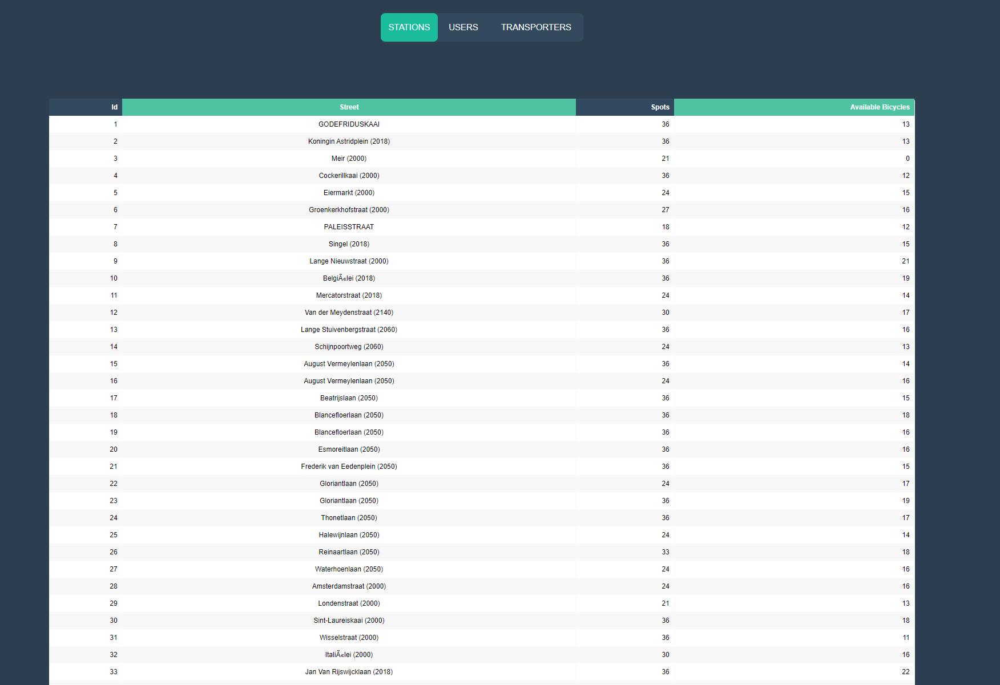

# Toon Van Hoye - Velo Simulatie

***

Als de Applicatie gestaret wordt met "-s" dan zal de simulatie direct van start gaan met de vorige data indien deze bestaat.

## Features

### Console

Als we Simulatie starten krijgen we de vraag of we de vorig simulatie willen hervatten.

                      ______ _                 _        _____ _                 _       _
                  | ___ (_)               | |      /  ___(_)               | |     | |
                  | |_/ /_  ___ _   _  ___| | ___  \ `--. _ _ __ ___  _   _| | __ _| |_ ___  _ __ 
                  | ___ \ |/ __| | | |/ __| |/ _ \  `--. \ | '_ ` _ \| | | | |/ _` | __/ _ \| '__|
                  | |_/ / | (__| |_| | (__| |  __/ /\__/ / | | | | | | |_| | | (_| | || (_) | |   
                  \____/|_|\___|\__, |\___|_|\___| \____/|_|_| |_| |_|\__,_|_|\__,_|\__\___/|_|   
                                 __/ |
                                |___/     

    Do you want to continue with previous simulation (y/n): 

Duwen we op n voor neen dan zal er een nieuwe simulatie gemaakt worden.
Je zal het aantal fietsen, user en transporters moeten kiezen.

    Building Simulation...
        Generating Bicycle Stations...
                 Made: 309 stations
        Amount of bicycles: 5500
        Generating Bicycles...
                 Made: 5500 Bicycles
        Allocating Bicycles...
                 Allocated: 5500 Bicycles over 309 Stations
        Amount of users: 4400
        Generating Users...
                 Progress: |█████████████████████████| 100.0% Complete
                 Made: 4400 Users 2194 Males and 2206 Females
        Amount of transporters: 10
        Generating Transporters...
                 Progress: |█████████████████████████| 100.0% Complete
                 Made: 4400 Transporters 7 Males and 3 Females

Daarna krijgen we Actions Menu dit is de Core van de Applicatie.

    <============ Actions ============>
    Borrow Bicycle as user (1)
    Bring in Bicycle as user (2)
    Borrow Bicycles as transporter (3)
    Bring in Bicycles as transporter (4)
    Run Simulation (5)
    Generate HTML (6)
    Exit (7)
    <=================================>

### Borrow Bicycle as user

Hier zal de user de optie krijgen om een user id te kiezen en een station id te kiezen.
Als de user al een fiets heeft wordt er een fout melding getoond. Dit gebeurt ook als het station geen fietsen meer
heeft.

### Bring in Bicycle as user

Hier zal er eerst een tabel getoond worden met alle users die onderweg zijn.
Wanneer je een user uit te tabel gekozen hebt zal je weer een station moeten kiezen.
Ook hier worden er fout meldingen gegeven moest je een verkeerde user genomen hebben of een station die vol is.

### Borrow Bicycles as transporter

Hier zal je een transporter id kiezen, een station id en het aantal fietsen die hij moet opnemen.
ook hier zullen de juist foutmeldingen gegeven worden.

### Bring in Bicycles as transporter

Eerst wordt er een tabel met alle transporters getoond die fietse hebben.
Erna zal je weer een transporter id kiezen en een station id en het aantal fietsen die hij moet afgeven.
Weer met controle op de inputs.

### Run Simulation

Eerst moet je 2 vragen beantwoorden.

    please enter the speed factor Example(4 = 4x real time) :
    Option between 1 and 1000: 100
    please enter the amount of active users per minute:
    Option between 10 and 500: 5

De eerste vraag is om de speed factor te kiezen. Deze factor bepaalt hoe snel de simulatie gaat.
Daarna krijg je de vraag om het aantal actieve users per minuut te kiezen.
Dit is het aantal users die per minuut een fiets zullen proberen te lenen zijn.

Dan zal de Simulatie starten.

### Generate HTML

Hier wordt er met de huidige gegevens een HTML pagina gegenereerd. Van de user. station en transporters

### Exit

Wanneer je de applicatie wilt verlaten zal er voor de huidige data gesaved worden in
Json bestanden zodat je de volgende keer verder kunt gaan met deze simulatie.

      Action: 7
      Saving Stations...
      Saving Users...
      Saving Transpoters...
      Closing..

## Simulatie

De simulatie verloopt in een loop met een Sleep die ingesteld
is op 60 secoden / de speed factor. Er gebeuren in deze loop telken 3 stappen.

1. Eerst worden er het aantal fietsen ontleent van willekeurige stations.
   Telken als er een fiets wordt ontleend wordt zal er een random nummer tussen 10 en 60 gekozen worden
   en deze wordt gebruikt om de tijd te bepalen in min wanneer de user op een ander station zal aankomen.
   Als er geen users meer zijn zonder fiets dan gaat de simulatie gewoon verder zonder deze stap te doen.
2. Als 2de stap wordt er gekeken voor elke user en tranporter of de minuten tot ariveren op 0 staat. als dit zo is bij
   een user
   zal hij zijn fietse in een random station plaatsen die niet vol zit. Als de minuten nog niet op 0 staat zal er een
   minuut agfaan.
   Voor een transporteur het zelfde alleen zal hij een station kiezen die minder dan de helft fietsen heeft of ze af te
   geven.
3. Als laatste stap wordt er naar stations gekeken die meer dan 80% vol zijn. Als er een station meer dan 80% vol is dan
   wordt er een random tranporter gekozen die nog niet onderweg is. Deze zal 30% van de fietsen nemen van het station.

## Logging

   Ook worden alle displacements van de users en transporters gesaved in een log file zoals hieronder.

      04-Jun-22 20:33:29 - INFO - User: Catherine (4157) borrowed a bicycle from Ganzemate (2170)
      04-Jun-22 20:33:29 - INFO - User: Miles (1500) borrowed a bicycle from Provinciestraat (2018)
      04-Jun-22 20:33:29 - INFO - User: Roberta (827) borrowed a bicycle from Beatrijslaan (2050)
      04-Jun-22 20:33:29 - INFO - User: Lillie (906) borrowed a bicycle from Brusselstraat (2018)
      04-Jun-22 20:33:29 - INFO - User: Eliza (3025) borrowed a bicycle from Italiëlei (2000)
      04-Jun-22 20:33:29 - INFO - User: Aimee (2769) borrowed a bicycle from Boudewijnssteeg (2018)
      04-Jun-22 20:33:29 - INFO - User: Barbara (623) borrowed a bicycle from Grotesteenweg (2600)
      04-Jun-22 20:33:29 - INFO - User: Keith (4340) borrowed a bicycle from Waalsekaai (2000)
      04-Jun-22 20:33:29 - INFO - User: Alice (1749) borrowed a bicycle from Burgemeester E. Ryckaertsplein (2600)
      04-Jun-22 20:33:29 - WARNING - All registered users are on the move!
      04-Jun-22 20:33:29 - INFO - User: Karen (76) Delivered a bicycle at Sint-Paulusstraat (2000)
      04-Jun-22 20:33:29 - INFO - User: Molly (145) Delivered a bicycle at Statiestraat (2600)
      04-Jun-22 20:33:29 - INFO - User: Teresa (191) Delivered a bicycle at Ruggeveldlaan (2100)
      04-Jun-22 20:33:29 - INFO - User: Deborah (260) Delivered a bicycle at Maurice Dequeeckerplein (2100)
      04-Jun-22 20:33:29 - INFO - User: Linda (282) Delivered a bicycle at Trapstraat (2060)
      04-Jun-22 20:33:29 - INFO - User: Edward (306) Delivered a bicycle at Ridderveld (2610)
      04-Jun-22 20:33:29 - INFO - User: Martha (321) Delivered a bicycle at Den Brem (2610)

## Zelfreflectie
   Persoonlijk vond ik het moeilijkste om de simulatie te maken omdat je hier heel diep en uitgebreid in kan gaan.
   Ik denk dat ik nog op een vrij simpele manier iets realistische heb kunnen maken zonder dat de simulatie vast loopt.
   Verder waren er niet direct grote obstacels. Ik vond het een leuk project om aan te werken en ik kan me echt amuseren met projectjes als dit.

   

